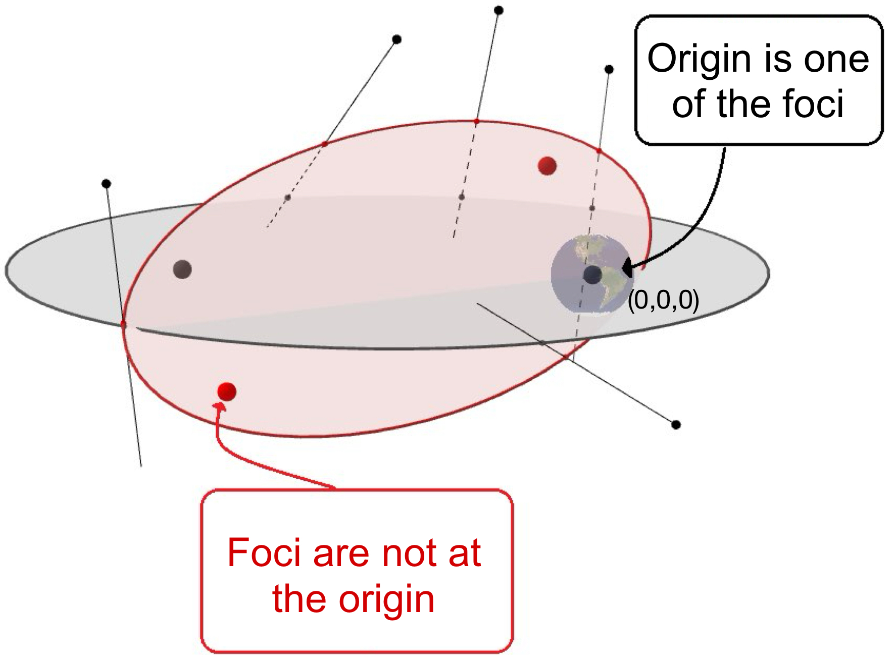
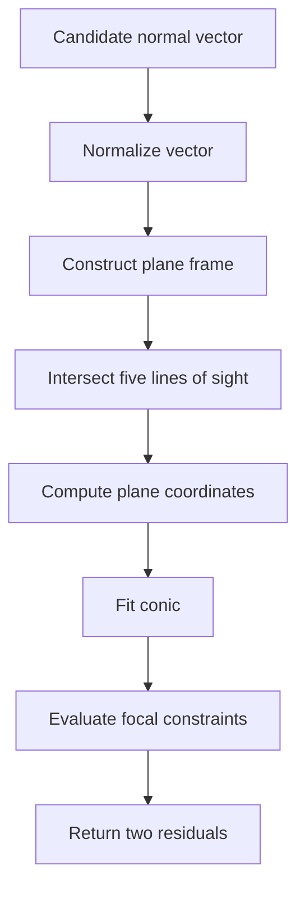

# Computational Comparison in Solving a Initial Orbit Determination Problem

## Current status (TODOs)


## Problem Description
Initial Orbit Determination (IOD) is a problem estimating the Keplerian orbit of any negligibly light celestial body around a heavy body, for example, a satellite around Earth.

The observations of an **angle-only** IOD are line of sights (LOS) which are rays in 3-D space that must intersect the orbit of the massless body. Given five LOS in space and assuming Keplerian dynamics, we want to recover the orbit - a conic section with a focus at the gravitating body (e.g. the origin). [Figure 1](#concept-illustration) displays two orbits going through five LOS in space, but we only aim to find orbits like the gray one, since the heavy body is one of its foci.

<p align="center">
  
</p>
<p align="center">
  <a id="concept-illustration"></a>
  <strong>Figure 1.</strong> IOD Examples
</p>

Converting this astrodynamics problem into an algerbaic-geometric problem, we design the following fast evalutation routine.

## Evaluation Routine (Master Function $F$)

The current implementation composes the following numerical stages:



$$
\mathbf{w}\in\mathbb{RP}^2,\qquad
F(\mathbf{w})=
\begin{bmatrix}
f_1(\mathbf{w})\\
f_2(\mathbf{w})
\end{bmatrix}
\in\mathbb{R}^2.
$$

The public entry point is:

```python
master_function(normal, positions, directions) -> F

normal:     shape (3,), float64, CPU,
positions:  shape (N, 3), float64, CPU,
directions: shape (N, 3), float64, CPU,
F:          shape (N,), float64, CPU
```

## Setup

Create and activate a virtual environment, then install the dependencies:

```bash
python -m venv .venv
source .venv/bin/activate
python -m pip install -r requirements.txt
```

## A Fabricated Example
This is an example with fabricated normal vector, position and direction data. The inputs are fabricated to be a true solution to this IOD problem, which means that the master function will return a zero vector. To run this example
```bash
python -m examples.basic_usage
```
The expected outputs are 
```text
normal_vector: shape=(3,), dtype=torch.float64
position_matrix: shape=(3, 5), dtype=torch.float64
direction_matrix: shape=(3, 5), dtype=torch.float64
output (free terms): tensor([-7.1054e-15,  2.1649e-15], dtype=torch.float64)
output shape: (2,)
output norm: 7.42792306414152e-15
```
Since the fabricated normal vector is designed to be a true solution, the free terms can be checked to be near zero.

## PyTest
Under Scientific-Computing-Portfolio-Project directory, run 
```bash
python -m pytest -v
```
The user should see that 19 tests are all passed.

## Repository layout

```text
src/
  __init__.py       Public package API
  core.py           Master Function and its numerical stages
tests/
  test_core.py      Unit and end-to-end tests
examples/
  basic_usage.py    Minimal runnable example (scheduled for Milestone 2)
requirements.txt    Runtime dependencies
```
